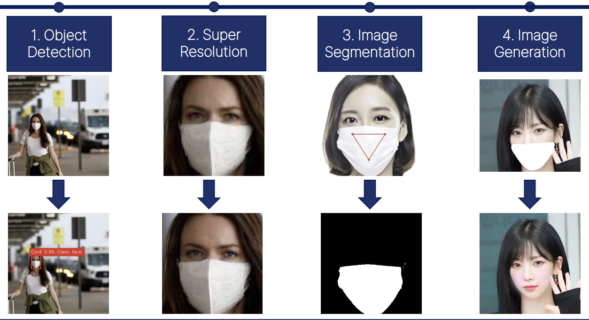

## '24 Winter Computer Vision - Team 이응이들

<h3> 잃어버린 얼굴을 찾아서 </h3>

[Jaeung Lee](https://github.com/gnueaj)1
, [Yuri Hong](https://github.com/glasshong)2
, [Jinhee Yoo](https://github.com/Geniefree) 2
, [Jeongyoun Kwon](https://github.com/kyuleeee) 3
, and [Jaeryung Hong](https://github.com/Jar199) 4&dagger;*
 
1Sungkyunkwan University&emsp;
2Korea University&emsp;
3Chung-Ang University&emsp;
4Ewha Womans University 
 
&nbsp;
 
 
Diffusion및 DreamBooth Fine-tuning을 활용한 마스크로 가려진 얼굴 생성  
 

